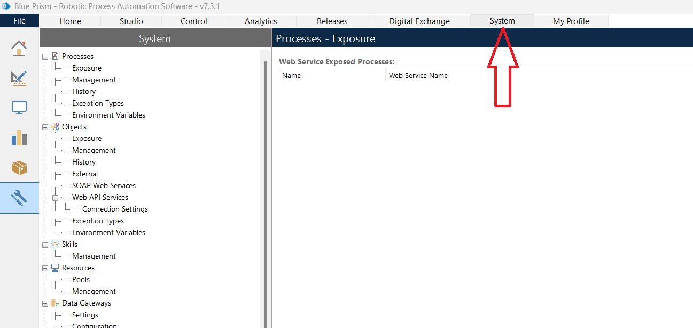
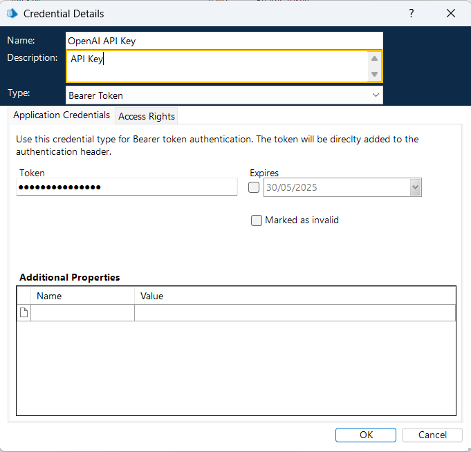
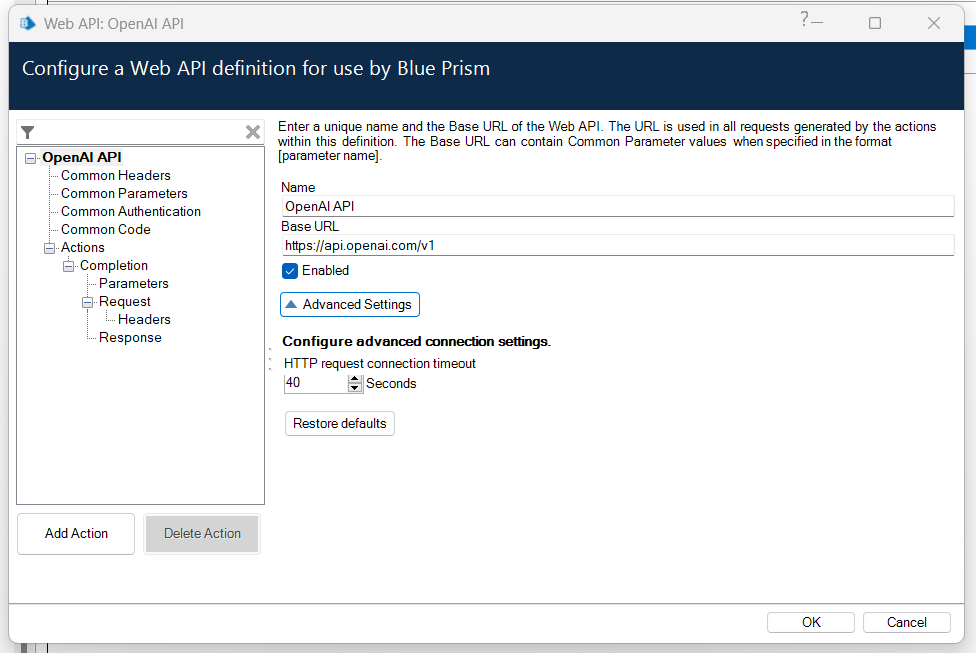
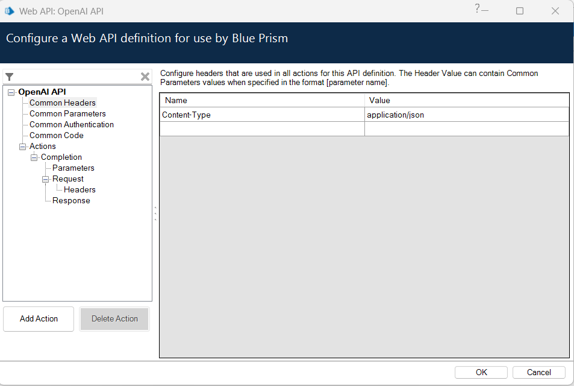
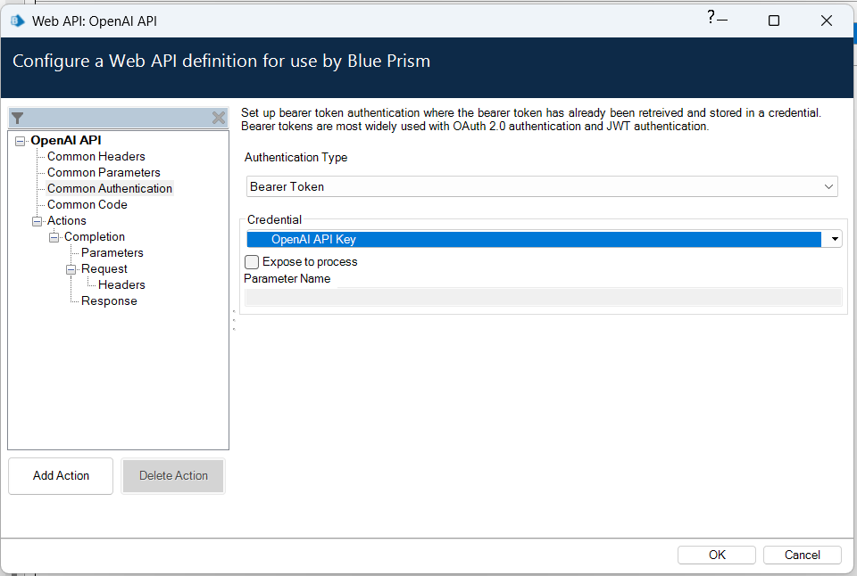
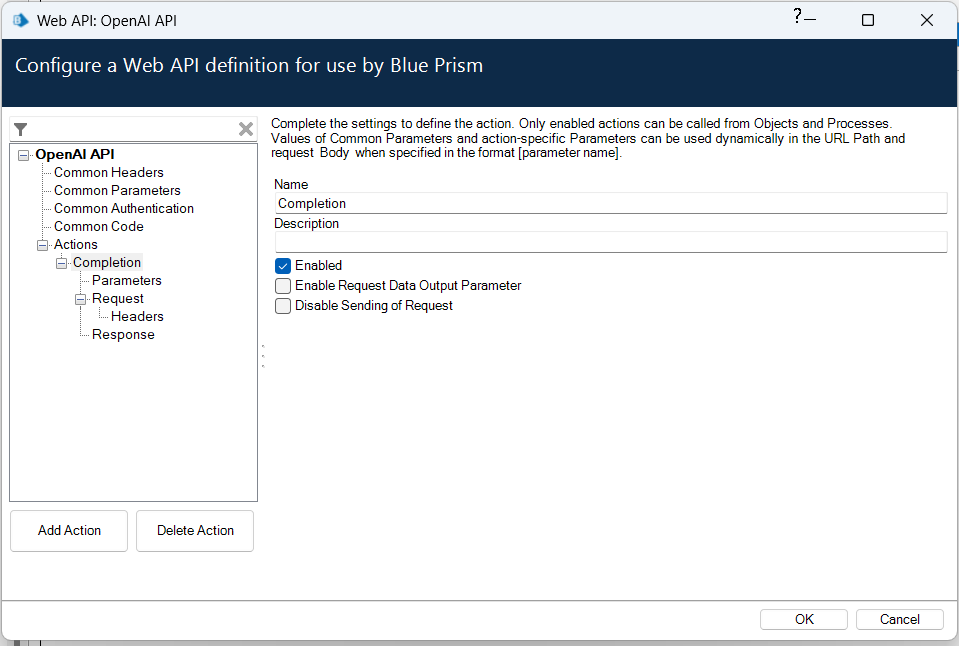
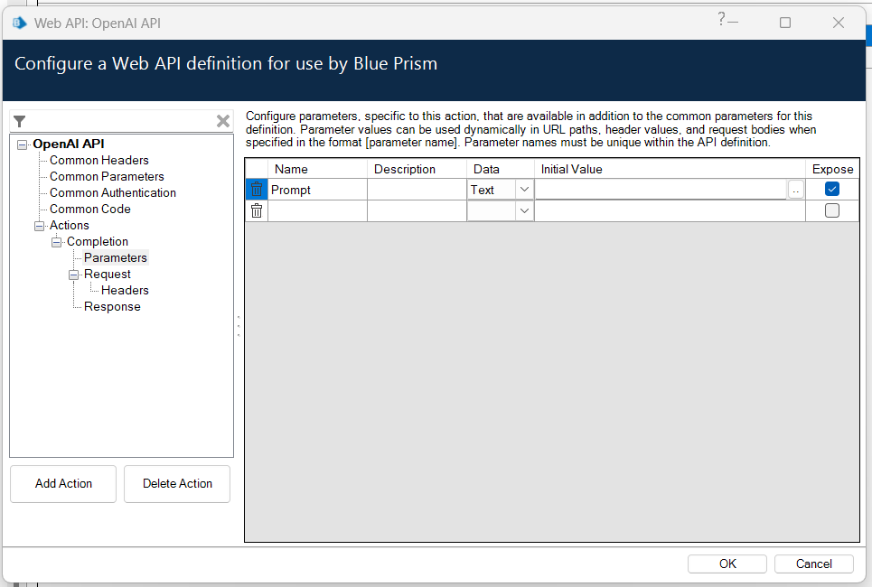
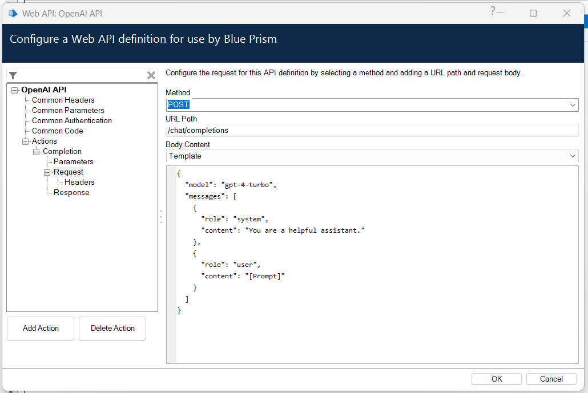
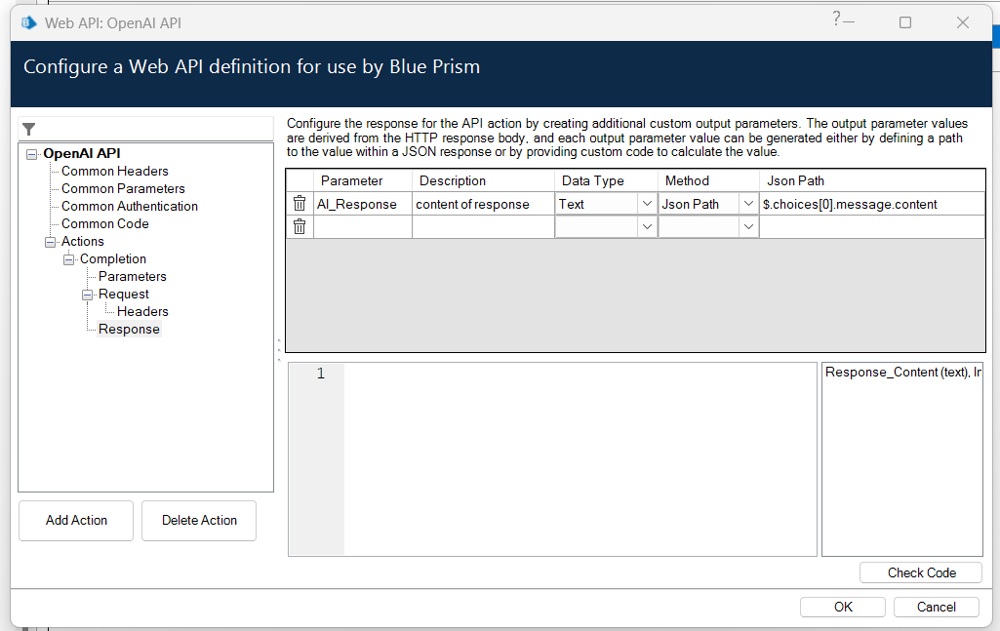
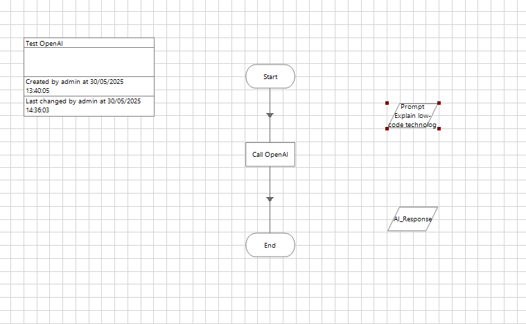

---

## 🔧 Blue Prism – OpenAI GPT API Integration Guide

 
### 🚀 Quick Start Option

If you don’t want to manually go through the integration steps, you can **simply download and import the Release file** from this repository.

👉 [Click here to view the full setup guide](./BluePrism-OpenAI-Setup.md)

---

This guide walks you through the step-by-step process of integrating OpenAI's GPT model (e.g., GPT-4-turbo) with Blue Prism using Web API Services. You’ll learn how to configure credentials, set up API headers, authentication, request/response mapping, and test the integration using a simple process.

---

### ✅ Prerequisites

Before you begin, ensure you have the following:

* A valid **OpenAI API key**
  👉 You can generate one by logging into your OpenAI account at [https://platform.openai.com/account/api-keys](https://platform.openai.com/account/api-keys)

* **Sufficient usage credits or tokens** in your OpenAI account

  > 🔔 *Note: The API will not respond successfully if your OpenAI account has no remaining credits or quota.*

* Blue Prism version **7.3 or later**

---

### 1. Launch Blue Prism

* Open the **Blue Prism** application.
* Click the **System** tab from the top menu bar.



---

### 2. Set Up API Key as a Credential

1. From the left-hand panel, go to:
   **Security → Credentials**
2. Click **New** on the right-hand pane.
3. Fill in the details:

   * **Name**: `OpenAI API Key`
   * **Description**: `API Key` (optional)
   * **Type**: `Bearer Token`
   * **Value**: Paste your OpenAI API Key (no `Bearer` prefix).
4. Click the **Access Rights** tab:

   * Under **Security Roles**, tick the appropriate roles (e.g., `Developers`, `Web Service Consumers`, or `All Roles`).
   * Optionally, allow access under the **Processes (legacy)** and **Resources (legacy)** tabs.
5. Click **OK** to save.



---

### 3. Add a New Web API Service

1. Under **Objects**, click **Web API Services**.
2. In the right-hand pane, click **Add Service**.
3. In the "Web API: New Web API Service" window:

   * **Name**: `OpenAI API`
   * **Base URL**: `https://api.openai.com/v1`
   * Click **Advanced Settings** and set:

     * **HTTP request connection timeout**: `40` seconds (important for longer GPT responses)



---

### 4. Configure Common Headers

1. In the left-hand tree, click **Common Headers**.
2. Add the following headers:

   * **Name**: `Content-Type`
     **Value**: `application/json`




---

### 5. Set Authentication

1. Click **Common Authentication**.
2. Set the values:

   * **Authentication Type**: `Bearer Token`
   * **Credential**: Select `OpenAI API Key`
   * Leave **Expose to process** unchecked




---

### 6. Add a New Action

1. Under **Actions**, click **Add Action**.
2. Rename the action to something meaningful (e.g., `Completion`).



---

### 7. Set Action Parameters

1. Click on **Parameters** under your action.
2. Add a new parameter:

   * **Name**: `Prompt`
   * **Description**: e.g., `Text input to send to GPT`
   * **Data Type**: `Text`
   * **Initial Value**: Leave blank
   * **Expose**: ✅ Checked



---

### 8. Set Request Details

1. Click on **Request** under your action.
2. Set the following:

   * **Method**: `POST`
   * **URL Path**: `/chat/completions`
   * **Body Content (Template)**:

```json
{
  "model": "gpt-4-turbo",
  "messages": [
    {
      "role": "system",
      "content": "You are a helpful assistant."
    },
    {
      "role": "user",
      "content": "[Prompt]"
    }
  ]
}
```

#### 🛠️ Customization Tips:

* **Model**: You can replace `"gpt-4-turbo"` with any other supported model for chat completions, such as `"gpt-3.5-turbo"` if cost or availability is a concern.
  Example:
  `"model": "gpt-3.5-turbo"`

* **System Prompt**: Adjust the `"content"` field under `"role": "system"` to guide the AI's behavior to match your use case.
  Examples:

  * `"You are a helpful assistant."` (default, general purpose)
  * `"You are an IT support bot for Blue Prism users."`
  * `"You are a legal advisor summarizing contracts in plain English."`
  


---

### 9. Set Response Mapping

1. Click on **Response** under your action.
2. Add a new output parameter:

   * **Parameter**: `content`
   * **Description**: `Content of response`
   * **Data Type**: `Text`
   * **Method**: `Json Path`
   * **Json Path**: `$.choices[0].message.content`
3. Click **OK**.



---

## 🧪 Testing the API in Process Studio

### 1. Create a Test Process

1. Go to the **Studio** tab.
2. Right-click **Processes** → Select **Create Process**.
3. Name the process (e.g., `Test OpenAI`) → Click **Next** → **Finish**.
4. Double-click the process to open it.

---

### 2. Add a Data Item

1. From the left-side panel, **drag the "Data Item"** icon onto the canvas.
2. Double-click the new data item to configure it:

   * **Name**: `Prompt`
   * **Type**: `Text`
   * **Initial Value**: `Explain low-code technology`
3. Click **OK** to save.
4. **Repeat step 1 to add another Data Item**, then configure it as follows:

   * **Name**: `AI_Response`
   * **Type**: `Text`
   * **Initial Value**: *(leave blank)*
5. Click **OK** to save.

---

### 3. Insert an Action Stage

1. From the left-side panel, **drag the “Action” stage** onto the canvas.
2. Double-click to configure:

   * **Name**: `Call OpenAI`
   * **Business Object**: `OpenAI API`
   * **Action**: `Completion`
3. Go to the **Inputs** tab:

   * Assign `[Prompt]` to the **Prompt** parameter.
4. Go to the **Outputs** tab:

   * Create a new data item called `AI_Response`
   * Map the **`content`** output to `AI_Response`
5. Click **OK**.
---

### 4. Link the Flow

* Connect the stages:
  **Start → Call OpenAI → End**



---

## ✅ Conclusion

Congratulations! 🎉
You’ve successfully integrated the **OpenAI GPT API** into **Blue Prism** and tested it in **Process Studio**. With this setup, you can now build intelligent automations that leverage the power of natural language understanding and generation — all within your existing RPA workflows.

---

### 🙋‍♂️ About the Author

**Chrysanthus Obinna Chiagwah**  
Developer \| AI & Automation Enthusiast  
📍 United Kingdom  
🔗 [LinkedIn Profile](https://www.linkedin.com/in/chrysanthus-obinna)  
🌐 [Portfolio Website](https://www.chrys-online.com)  

---

 